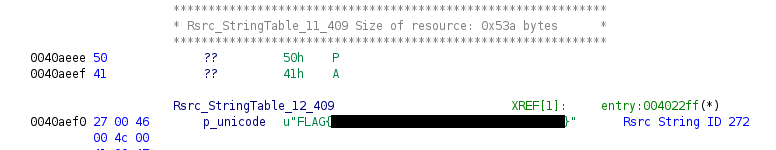

### THM - Basic Malware RE

Link: [https://tryhackme.com/room/basicmalwarere](https://tryhackme.com/room/basicmalwarere)

Difficulty: Medium 

"These challenges are aimed towards learning about the "Static Analysis" technique used to analyze the malware. The main aim for this room is not to used any types of debuggers neither the executable's/programs should be run on any platform. You are required to answer all the questions without even using the debugger and even not executing the executable's/programs.

Meanwhile all the credits goes to @MalwareTechBlog for creating these awesome challenges." - THM

#### Tools Used

FLOSS and Ghidar

#### Lets get started

#### string1.exe

After downloaded the file, I use FLOSS to extract the strings from the file.

We can see that there are way too many strings. We have to find out which one is the flag. Let's use Ghidra to see if we can find the flag.

After decompling the file, we can see in entry function that there is a variable called "lpText" which calls a function "md5_hash". md5_hash function takes 1 char type parameter and we can see that the parameter is a pointer to our flag. If we follow the address of that pointer (0x424828), we can see that it is pointing to the flag.

#### string2.exe

Let's do the same thing for string2.exe

After using FLOSS, we can see that there is a string pulled from stack. We can double check that by using Ghidra.

We can see that there are a lot of variables in the entry function. The last variable "local_8" is the hash value which is a return value from function "md5_hash". md5_hash takes a parameter which is are the chars and hex value from variable "local_2c". Combine all the chars and hex value(the hex value represent ASCII charactor), we can get the flag. Just like the string that was pulled from stack by FLOSS.

#### string3.exe

Let's start with FLOSS.

We can see that there are 97 static strings. Let's use Ghidra to see if we can find the flag.

After decompling the file, we can see some variables and some functions. What stands out are the function "LoadStringA()", and "FindResourceA()". 

LoadStringA is a function from USER32.dll. After some research, I found the document of the library. ([https://learn.microsoft.com/en-us/windows/win32/api/winuser/nf-winuser-loadstringa](https://learn.microsoft.com/en-us/windows/win32/api/winuser/nf-winuser-loadstringa))  LoadStringA takes 3 parameters. The first parameter is the handle to the module. The second parameter is the ID of the string to be loaded. The third parameter is the buffer that receives the string. In our case, the ID of the string is 0x110 which is 272 in decimal. 

If we take a look at the Rsrc_StringTable we can see that there is a string with ID 272. That would be our flag.

Thanks for reading.
