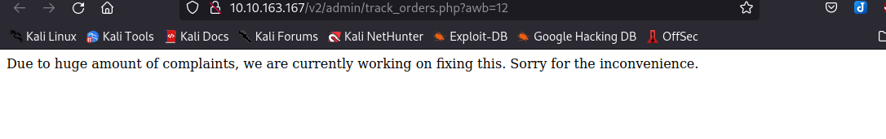
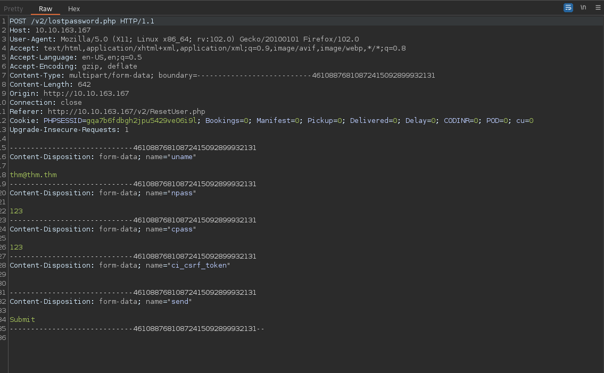

### THM - Road

Link to the room: [Road](https://tryhackme.com/room/road)

Difficulty: Medium

'Inspired by a real-world pentesting engagement' - THM

#### Recon

We can start with nmap scan command:

```sudo nmap -sS -sV -Pn -p- {IP}```


We can see that port 22 and 80 is open. Let's check on the web page and do some basic enum on the webpage.


After some enum on the web page, we can see that there is a broken api endpoint. Nothing is really out of ordinary in the page source as well but there is also a login page that allow us to register a new account. Let's try to register a new account and see what we can find.


Great! with our new account, let's do some enum on this dashboard.

After some enum on the dashboard, we can see that there is a broken api endpoint ```http://10.10.163.167/v2/admin/track_orders?``` pretty much the same as the front page but this time. It will redirect us to ```index.php```. A profile page and a reset password page.





However, there is a couple of things that are standing out. In ```profile.php``` page, we can see that there is an option to upload a profile picture but only admin can use this feature. The message also said that we can contact the admin at ```admin@sky.thm``` We can assume that this is the admin user account and according to the source, the button 'Edit Profile' is the submit button. However, if we try to upload an image, it won't doing anything. In the page source, we can also see a hidden directory called ```/v2/profileimages/```. Let's check it out.


We get a message that it is disabled but we can still access it. Let's try to leverage this to get us a reverse shell. Let's start by playing around with that reset password page. Let's fire up our burp suite and intercept the request.




The request is pretty simple. It is just a post request which takes ```uname, npass, cpass``` as parameters. We can see that ```ci_csrf_token``` parameter leaves empty and ```send``` parameter as ```Submit```. This is no security at all. Let's try to change user admin's password. We can use the same request but change some parameters.


Great! Let's try to login with admin user account.


Perfect! Let's get our shell. We will be using [a php reverse shell from pentestmonkey](https://raw.githubusercontent.com/pentestmonkey/php-reverse-shell/master/php-reverse-shell.php). Let's try to upload it to the ```/v2/profileimages/``` directory.


We can see that we have a message saying that "image saved". Let's start our netcat listener and try to access the shell.


Great! We have our shell. Let's make it feels a bit more like home. Let's try to get the user flag.


Let's now do some enum on the system.

Surprisingly, we can have privilege to read in 'webdeveloper' user's home directory. Let's get our user flag.


#### Privilege Escalation

After some manual enum on the system, we can see that there are multiple lisenning ports that are open. Let's do some research on the ports.


After some research, we can see that port 3306 and 33060 are for MySQL ports https://dev.mysql.com/doc/mysql-port-reference/en/mysql-ports-reference-tables.html. Port 27017 is a MongoDB port https://www.mongodb.com/docs/manual/reference/default-mongodb-port/

Let's do some enum on them. We can start with MySQL.


We can see that we can't access MySQL with www-data user but we can access mongodb with this user. Let's see what we can find. Here is the mongodb cheat sheet https://gist.github.com/bradtraversy/f407d642bdc3b31681bc7e56d95485b6 


After some enum on the database, we can see that in the backup database, there is a user table. After using command ```db.users.find()``` we can see that there is a user called 'webdeveloper' with a clear text password. Let's try to switch to this user.


Great! We have a shell as webdeveloper user. Let's do some enum on this user.


We can see that the LD_PRELOAD function is enabled on the "env_keep" options. This is an easy win for us. Let's create a share library and use it to get our root shell.

```
#include <stdio.h>
#include <sys/types.h>
#include <stdlib.h>

void _init() {
  unsetenv("LD_PRELOAD");
  setgid(0);
  setuid(0);
  system("/bin/bash");
}
```

```gcc -fPIC -shared -o shell.so shell.c -nostartfiles```


Great! now let's get our root shella and root flag.


Thank you for reading my writeup.